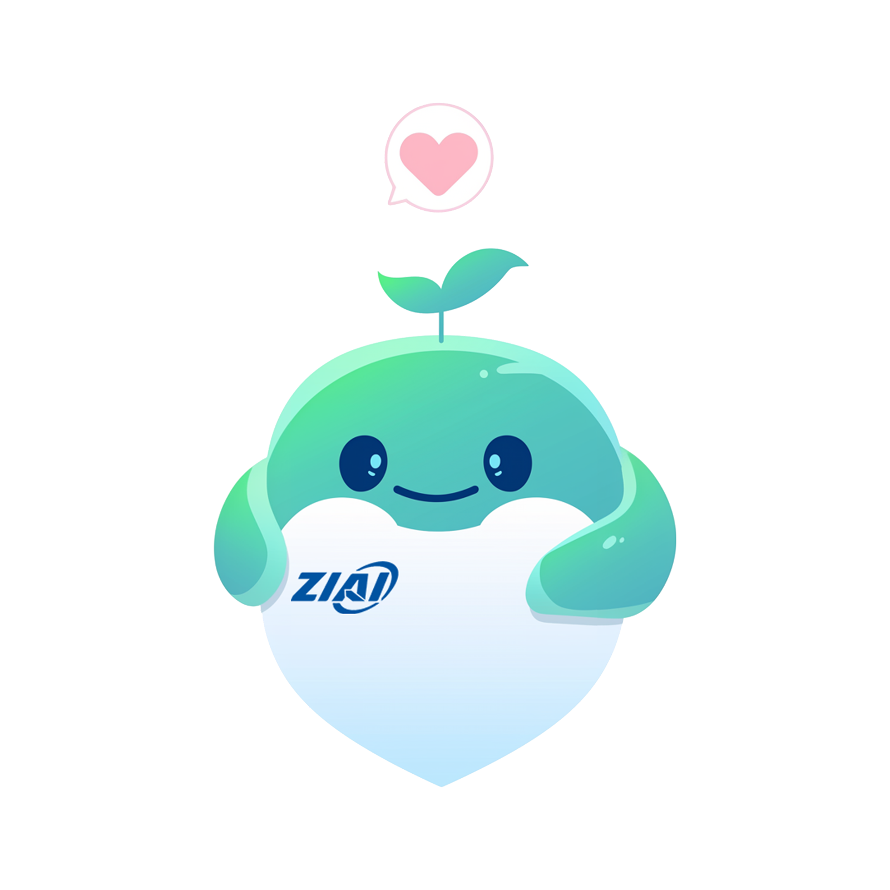

<h1 align="center">问心: 心理大模型</h1>

<div align="center">
  
</div>

## 🎉 项目进展

- **Aug 5, 2024**: 首次提交问心心理大模型

## 👏 模型介绍

“问心”心理大模型是专门为青少年心理健康提供支持的人工智能模型。该模型通过融合多种心理咨询流派技术和覆盖青少年常见心理问题，提供跨时空的专业咨询服务。

- **融合流派**: 认知行为疗法（CBT）、人本主义、叙事疗法、格式塔疗法、心理动力学、短期焦点疗法等。
- **应对问题**: 焦虑、抑郁、自我认知问题、网络成瘾、身体与关系霸凌、家庭关系等。
  
在技术实现上，问心心理大模型通过大数据支持的智能对话系统进行深度学习训练，持续优化其情感识别和个性化服务能力。模型采用了多轮对话数据集和强化学习方法，经过增量预训练和有监督的微调（SFT），确保其能够理解和应对多样化的心理需求。模型在隐私保护和伦理规范方面也进行了严谨设计，充分考虑用户的隐私和数据安全。

## 🖥️ PC端展示

<div align="center">
  
</div>

[//]: # (## 🌐 体验链接)

[//]: # ()
[//]: # ([**点击体验**]&#40;https://www.huaxiapsy.com/mobile/pages/chat/chat&#41;)

## 📣 对话案例

以下是对话案例的部分JSON数据：
```json
[
  {
    "data": "A:听起来你现在的学习压力非常大。你能告诉我，当你感觉到学习压力稍微小一些的时候，你的生活有哪些变化吗？\nQ:我可能会有更多的时间去做自己喜欢的事情，比如运动或者看电影。\nA:那么，在过去有没有某个时刻，你感觉到学习压力减轻，能够享受到这些你喜欢的活动？\nQ:有的，上个学期我参加了一个学习小组，我们互相帮助，感觉压力小了很多。\nA:在小组中互相帮助是一个很好的方式。你能具体说说，是什么让小组学习对你来说特别有帮助吗？\nQ:我觉得是因为我们可以分工合作，每个人负责一部分内容，然后分享给其他人，这样大家都能学到更多，而且不会感到那么累。\nA:分工合作和分享知识，这听起来是一个非常有效的学习策略。现在，想象一下，如果你能将这种合作学习的方式应用到你的日常学习中，你的学习生活会有哪些不同？\nQ:我想我会更少感到焦虑，因为我知道我有队友可以依靠。\nA:更少的焦虑和依靠队友，这些都是积极的变化。那么，你打算如何将这种合作学习的方式应用到你目前的学习中呢？\nQ:我可以尝试联系一些同学，看看他们是否愿意和我一起组成学习小组。\nA:这是个很好的计划。记得，即使是小步骤，也能带来大变化。我们下次再聊时，我很期待听到你在这方面的进展。\n",
    "cate1": "短程焦点解决",
    "cate2": "学习问题",
    "tag": "（学习压力大）"
  },
  {
    "data": "Q:医生，我感到学习压力特别大，每次考试我都特别紧张，担心自己考不好。\nA:考试带来的紧张感是很常见的现象，特别是当我们对自己的表现有所期待时。你能告诉我，在过去，有没有哪一次考试你感觉自己做得还不错？\nQ:嗯，有一次模拟考试，我准备得很充分，所以考试时没那么紧张。\nA:准备充分是减少紧张的一个有效方法。你是如何做到那次模拟考试准备充分的？\nQ:我提前很久就开始复习，每天都有固定的学习计划。\nA:每天固定的学习计划帮助你减轻了考试的压力。那么，除了提前复习，还有什么其他因素让你觉得那次考试比较顺利？\nQ:我还有做一些模拟题，这样我能更熟悉考试的题型。\nA:通过模拟题来熟悉考试题型是一个很好的策略。现在，想象一下，如果你在接下来的考试中也采取这样的策略，你的考试经历会有什么不同？\nQ:我可能会感到更加自信，也许不会那么紧张。\nA:更加自信和减少紧张感，这都是很有价值的目标。你打算如何确保自己能够持续地采取这些方法？\nQ:我可以继续制定学习计划，并且每天做一些练习题。\nA:这是个很好的计划。记住，每一个小的进步都值得庆祝。期待在我们下次的对话中听到你的进步。\n",
    "cate1": "短程焦点解决",
    "cate2": "学习问题",
    "tag": "（学习压力大）"
  },
  {
    "data": "Q:医生，我觉得自己学不进去，不管我怎么努力，成绩就是提不上去。\nA:感到学习效果不如预期确实会让人感到沮丧。在你过去的学习经历中，有没有哪个时刻，你感觉到自己学得比较好？\nQ:有的，之前我在学习历史的时候，因为我对那个时期特别感兴趣，所以记得很快。\nA:兴趣是学习的一个很好的驱动力。你是如何利用你的兴趣来学习的？\nQ:我会阅读很多相关的书籍和资料，甚至看一些历史纪录片。\nA:通过阅读和观看纪录片来扩展你的知识，这是个很好的方法。那么，你认为这些方法是否可以应用到你目前觉得困难的其他学科上？\nQ:我可以试试，比如找一些我感兴趣的科学实验视频来看。\nA:利用视频资源来增加学习的趣味性，这是个不错的主意。现在，想象一下，如果你能够在学习其他科目时也找到一些让你感兴趣的点，你的学习体验会有什么不同？\nQ:我可能会更愿意去学习，而不是感觉被迫。\nA:更愿意学习而不是感觉被迫，这是一个积极的变化。你打算如何找到其他学科中你感兴趣的点？\nQ:我可以去图书馆找一些有趣的参考书籍，或者在网上搜索一些相关的趣味知识。\nA:探索不同的资源是一个很好的开始。记得，每一步小小的探索都可能带来新的发现。期待在你下次访问时听到你的新发现。\n",
    "cate1": "短程焦点解决",
    "cate2": "学习问题",
    "tag": "（学习压力大）"
  }
]
```
你可以在此查看和预览完整的JSON数据：[查看对话数据](./data/dataset_example.json)

## 📧 联系方式

<div style="text-align: left; margin-left: 20px; color: #0366d6;">
   <a href="mailto:17812036026@163.com" style="color: inherit;">17812036026@163.com</a>
</div>

## 🙇‍ ‍致谢

在项目进行中受到以下平台及项目的大力支持，在此表示感谢！

1. **LLama3**: 提供非常优秀的基础模型。